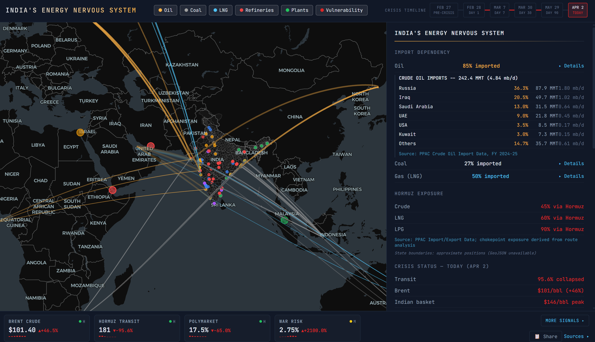

# India's Energy Nervous System

Real-time intelligence dashboard for India's energy supply chain -- trade routes, refineries, power plants, and the Hormuz crisis.

**[View the dashboard](https://avyayalaya.github.io/india-energy/)**

Built entirely from official public data. Every number sourced.

---

---

## What you'll see

- **39 trade routes** (oil, coal, LNG) with volume-weighted arcs across the Indian Ocean
- **23 refineries** with Hormuz exposure analysis and capacity data
- **123 power plants** from MERIT India dispatch data with merit order rankings
- **State vulnerability ranking** (Gujarat to Chhattisgarh) with generation mix breakdowns
- **Crisis cascade timeline** (Feb 28 to today) tracking the Hormuz disruption
- **Chokepoint analysis** -- Strait of Hormuz, Strait of Malacca, Suez Canal
- Every number sourced to official data with inline citations

## Data Sources

| Source | What it covers |
|--------|---------------|
| [PPAC](https://ppac.gov.in/) | Crude oil imports, refinery capacity, LNG/LPG imports, petroleum trade data |
| [Ember Energy](https://ember-energy.org/data/yearly-electricity-data/) | Yearly and state-level electricity generation data (2024) |
| [IMF PortWatch](https://portwatch.imf.org/pages/chokepoint6) | Strait of Hormuz daily transit data and chokepoint monitoring |
| [MERIT India](https://meritindia.in/) | Plant-level merit order dispatch data (Ministry of Power) |
| [EIA](https://www.eia.gov/dnav/pet/pet_pri_spt_s1_d.htm) | Brent crude spot prices |
| [IEA](https://www.iea.org/reports/oil-market-report-march-2026) | Oil Market Report, collective action (SPR release) decisions |
| [CEA](https://cea.nic.in/installed-capacity-report/) | Installed generation capacity report |
| [ISPRL](https://isprl.co.in/) | Indian Strategic Petroleum Reserves |
| [DGCI&S / Commerce Ministry](https://commerce.gov.in/trade-statistics/) | Trade statistics |
| [RBI](https://rbi.org.in/Scripts/PublicationsView.aspx) | Monetary policy and macroeconomic projections |
| [Lloyd's List](https://www.lloydslist.com/) | Vessel transit and maritime intelligence |
| [PIB](https://www.pib.gov.in/) | Government press releases on energy security |
| [MEA](https://www.mea.gov.in/press-releases.htm) | Ministry of External Affairs -- Hormuz situation statements |

## Technical details

Single self-contained HTML file. No build step, no server, no API keys.

| Library | Purpose |
|---------|---------|
| [deck.gl](https://deck.gl/) | WebGL-powered data visualization layers (arc, scatterplot, icon) |
| [MapLibre GL](https://maplibre.org/) | Open-source vector map rendering |
| [CARTO Dark Matter](https://carto.com/basemaps/) | Dark basemap tiles |
| JetBrains Mono + DM Sans | Typography |

## License

Data sourced from public government and international agency publications. Dashboard code is open source.

---

Built with [Agent Prime](https://github.com/avyayalaya).
